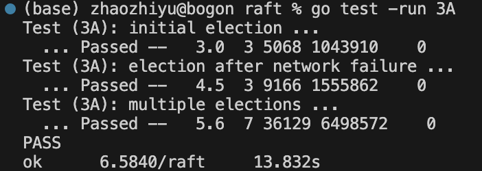
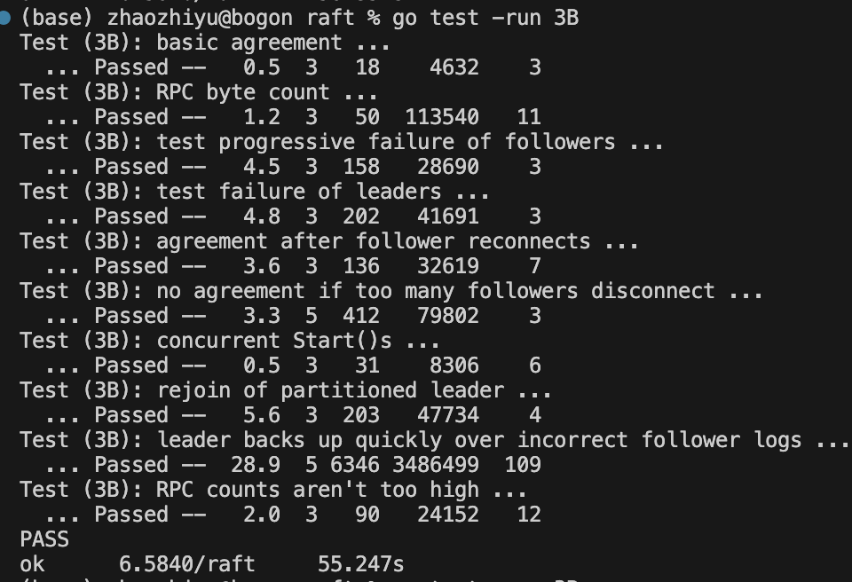
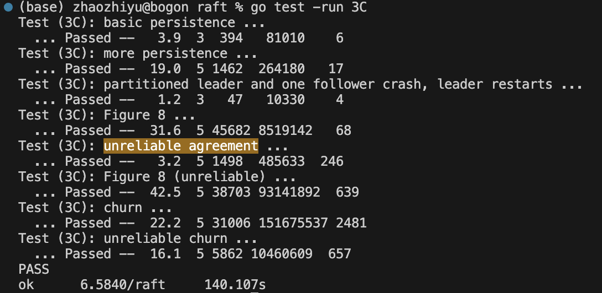
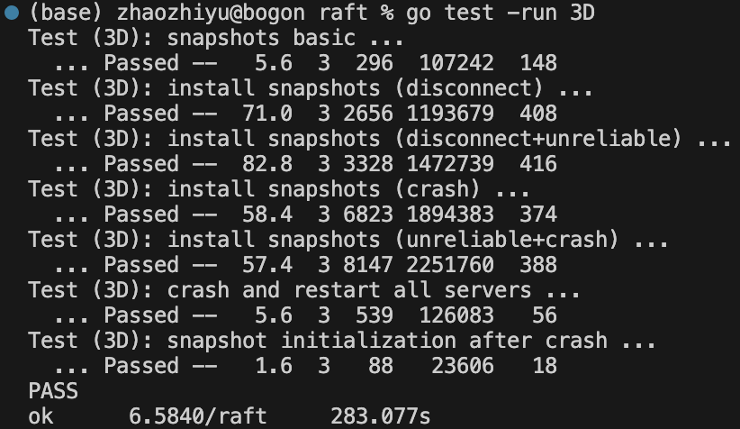

# 开发日志

### Task A

遇到的问题及解决方式：

* 最开始报rpc.call不能decode的操作，通过**将args和reply打印**的方式发现**reply Slice没有初始化**

* rpc low-case报错，发现rpc的message内的子结构体也要字段大写

* 通过添加`isTheLeaderAlive`字段的方式存储与leader的联通情况，另外leader自身的该字段永远为true，follower每隔一个*electionTimeout* 取false一次

  * net fail通过不了，最开始以为是*electionTimeout* 太短，剩下的两个server互锁，且拉长*electionTimeout* （超过MTBF）后通过测试，由此优化了投票发起的耗时，改换了原子增加`atomic.AddInt32(&count, 1)`（TODO，调回去）；通过打印、调试发现server进入cand阶段后**voteFor永远是自己**，于是**回扣论文**发现了每一个rpc handler应该加一个检验term否shi过期的mw：

  > If RPC request or response contains term T > currentTerm:set currentTerm = T, convert to follower (§5.1)

* 求证election落选的Third状态，解决term是否增加的疑问：

  > by incre menting its term and initiating another round of Request Vote RPCs.

* 惯性，以为`ok := rf.sendRequestVote(i, args, replys[i])`要循环到底，实际上raft的所有设计就是为了不保证强一致性的情况下达成最终一致性，于是不必重复请求，否则旧的请求获取会充斥网络

  * 论文里说要循环到底，但是不必
  * context管理每一个并发的grountinue？

### Task B

遇到的问题及解决方式：

* basic agreement，*log的index从1开始*（论文细节），初始有一个空的log记录（PreLogIndex兜底）
* applyCh的理解，翻test调用的源码后才明白，与commit同步，告知client已经提交；遇到的坑：1、follower没有apply；2、批量提交leader只apply了最后的一个；报错类似`apply out of index`，即client拿着提交的index-1没有，不是追加append。
* commit不一致，不满足Log Matching Property，报错类似`apply error: commit index=53 server=3 2647057821534522169 != server=4 8321690758582039880`，在某一个已经提交的index下，集群内部服务器不一致。导致不一致的情况有（尤其在rejoin of partitioned leader测试下）：
  * 过气leader未抵达majority的log被错误提交，原因是 the Leader Completeness Property条件理解错了，使得宕机的leader由于log更长在强制拉平任期后（term小）的情况下又获选，旧但长的log覆盖其他server新的log（和论文中未制定该策略的例子一致）
  * 过气leader成功退位follower，但commitIndex（不算该过气leader，已经多数接受commit了的）的更新领先于log的更新（心跳可以带给follower commit信号，因为倘若不如此，没有新的command到达的情况下，follower就不会得知commit的情况，就无法fail to reach agree），心跳先于re-send到达过气leader，使得其旧的log（没commit）被commit上去，使得冲突；解决方案是在将consistencyCheck提到全局，心跳中也携带prelog（但没有在心跳机制中做nextindex的更新，todo），未达成nextindex一致时follower不commit，达成一致后也不会立即commit，commit部分把prelogindex也min进去，只apply跟leader同步的部分
    * fial to reach agree另外的情况是，prelog出错，导致commit的又被删掉or其他原因，反正leader这边已经commit了但follower一致没apply，测试全部通过后出现过一次这种报错，后来又不出现了（可能是降低*broadcastTime*之后，append的请求相对没那么慢了，导致follower和leader同步的相对更快了
* bytecount测试，💗太多了（rpc自身成本挺高）
* tofollower直接return了，加强条件了，论文里说的是to follower没说立刻返回
* 写代码和读论文相辅相成

### Task C

遇到的问题及解决方式：

* nextIndex和sendeAppendEntries的Index总是有越界的问题（-1/out of range），由于实现符合论文要求但工程效果差矣，认为是并发导致的不可预料的错误，于是**兜底限制条件**就很少再报错了。

  * 似乎并发会导致很多莫名其妙的错误，很难debug也很难复现，只能是**执行操作之前验证条件是否还成立**。工程问题，非算法问题。（你以为的代码表现的行为和它实际的行为不一样。）

* persist最开始**阅读/理解论文**有偏差，持久化了所有state。

* 通过**读测试源码**，发现是kill之前copy的，所以persist要**在state变化时**：Insert calls to `persist()` at the points where your implementation changes persistent state.

* 对于间或出现的bug，决定重新读一遍论文1、为代码做了标注；2、解决了3B该解决的一些问题：

  * 删掉了releaseBlankAppend解决了figure-8的问题：TODO修改成append一个nil command的log，如此可以追更上一任的logs，解决类似cannt reach agreement 或者only 2 decided for index 4; wanted 3

    

    很烦，加了relaseBlank又回有这种问题（不过立刻发一个空的log只有在脑裂里面提及过，但是脑裂的两种解决方案

    > To find out, it needs to commit an entry from its term. Raft handles this by having each leader com- mit a blank *no-op* entry into the log at the start of its term. Second, a leader must check whether it has been de- posed before processing a read-only request (its informa- tion may be stale if a more recent leader has been elected).

    1、发一个空的log append；2、leader自动退位；

  * commonIndex roll back的问题：通过阅读论文意识到，**全局的commonIndex只增不减**，因为log match策略和选举限制，**commit的实质是log中majority**；

* figure-8 unreliable时出现的apply error

  * 同一个term会出现两个leader，原因是append抹平了votedfor，应该区分==和>两种tofollower的形式

### Task D

遇到的问题及解决方式：

* 由于引入的log瘦身机制，需要重写len(log)和log根据index取值，并对于baseIndex相关的越界问题（delay的请求）丢弃处理

* 上Snapshot直接死锁，通过在每一个lock的地方打点，发现是updateApply时候的锁和snapshot互锁，进一步定位applyCh读取需要snapshot完，而snapshot推进需要applyCh推送完释放锁的问题；解决方案：异步snapshot
  * 一开始想的是异步updateapply chan，但是会带来重复apply的问题
* 症状：out of range，病因：异步snapshot带来乱序snapshot的问题，导致baseIndex回退，导致get，药方：直接丢弃旧的
* 症状：[-9]/重复apply，病因：install 之后 commonIndex没有及时更新导致 baseIndex更新了，但是from旧的index开始update
* 追更install之后follower的applysnapshot「论文细节忽略/理解错误」，出现死锁问题；排查发现内外嵌套加锁了
* 症状：重复apply，病因：install之后log剪裁错误，导致已经snapshot的日志没有被删掉，当作新的日志在heartbeat打时候被apply
* 症状：unreach agreement，病因：consistencyCheck里的没有检测到baseIndex后一位「工程实现问题」，导致无法达成共识，nextIndex roll back了
* 症状：没有start塞过的command无法达成agreement，怀疑leader没选出来，askforvote使用了len(rf.log)
* 症状：expect 10 get 1，病因：1、读不进去snapshot，因为无需decode snapshot；2、没有更新commit
* 症状：expect 1 get 10，病因：snapshot save fail，没有在copy的时候给一个同等长度的数组
